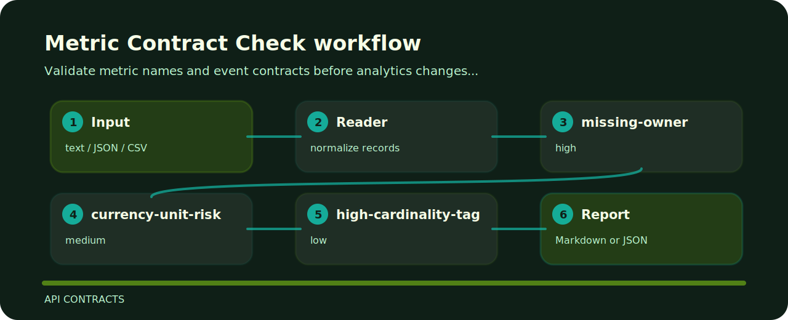

# Metric Contract Check


Validate metric names and event contracts before analytics changes ship. It keeps the review small: one input file, a short list of findings, and enough context to fix the line that caused the warning.

## Inspection line



## Signals

| Signal | Level | What it flags | Fix direction |
| --- | --- | --- | --- |
| `missing-owner` | high | metric ownership is missing | Assign an owning team before accepting the metric. |
| `currency-unit-risk` | medium | money metric may not declare units | Declare currency and scale explicitly. |
| `high-cardinality-tag` | low | high-cardinality tag detected | Remove per-user tags or route to logs instead of metrics. |

## Command path

```bash
git clone https://github.com/mertefekurt/metric-contract-check.git
cd metric-contract-check
python -m pip install -e ".[dev]"
metric-contract-check examples/sample.txt
```
