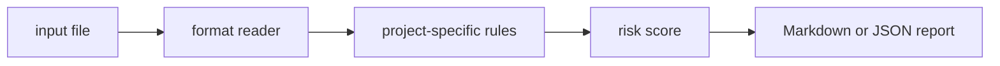

# metric-contract-check

`metric-contract-check` is a small local CLI that validate metric names and event contracts before analytics changes ship.

## Why it is useful

Analytics regressions are hard to debug after dashboards break. This CLI catches risky metric naming and ownership gaps in review.

## Key features

- reads text, JSON, JSONL, or CSV inputs
- returns Markdown or JSON reports
- supports severity-based CI exit codes
- keeps all checks deterministic and offline
- includes focused rules for this project:
- `missing-owner`: metric ownership is missing
- `currency-unit-risk`: money metric may not declare units
- `high-cardinality-tag`: high-cardinality tag detected

## Installation

```bash
python -m pip install -e ".[dev]"
```

## Usage

```bash
metric-contract-check examples/sample.txt
metric-contract-check examples/sample.txt --json
metric-contract-check path/to/input.txt --fail-on medium --out report.md
python -m metric_contract_check --help
```

Example input:

```text
event: checkout.failed metric missing owner and unit dollars_total
```

## CLI options

```text
metric-contract-check INPUT [--format auto|text|jsonl|csv|json] [--json]
             [--fail-on low|medium|high] [--out PATH]
```

`INPUT` is any metric contract text or event spec. The tool exits with code `2` when findings meet the selected
threshold, which makes it easy to use in GitHub Actions or release checks.

## Workflow



## Tests

```bash
ruff check .
pytest
python -m metric_contract_check --help
```

## License

MIT
